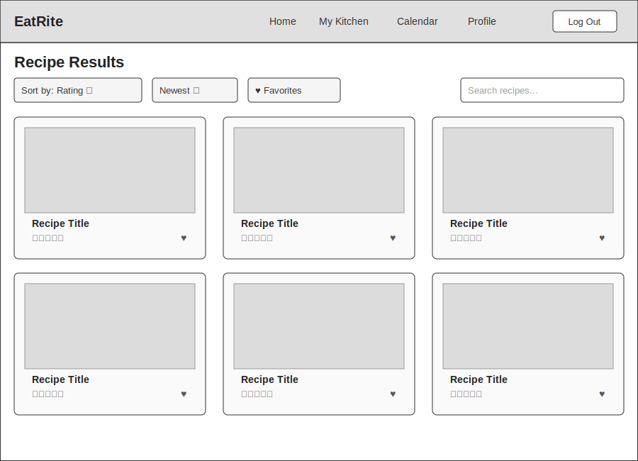
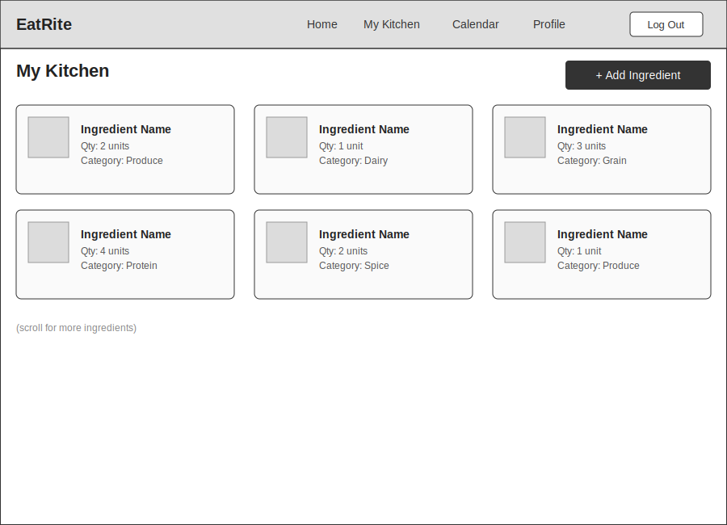
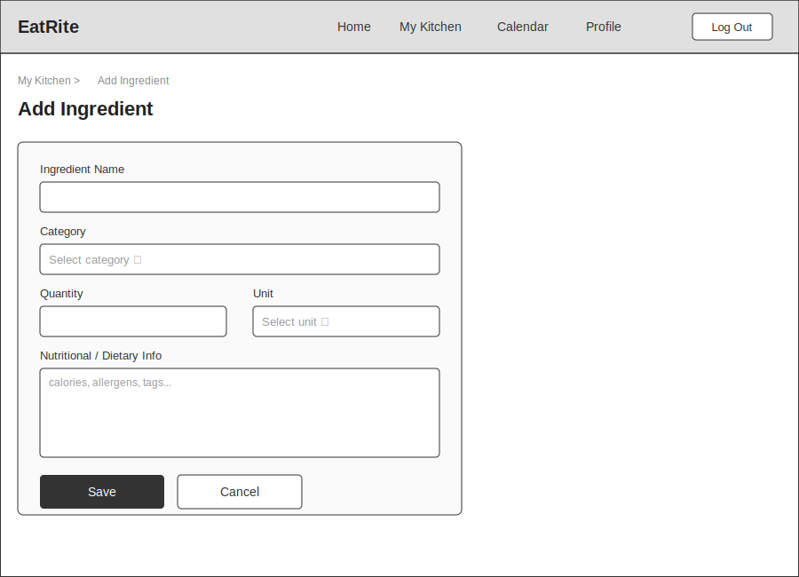
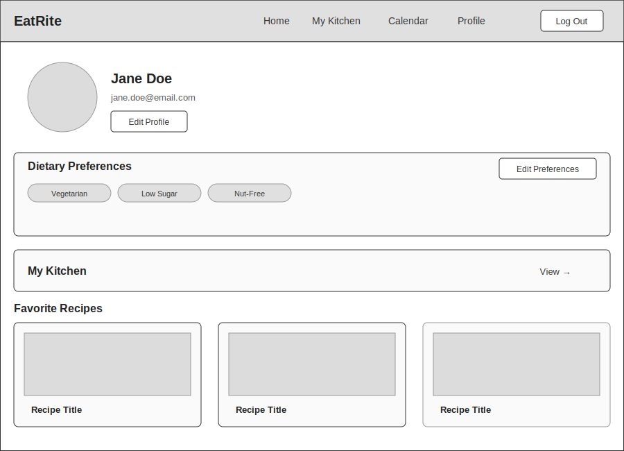
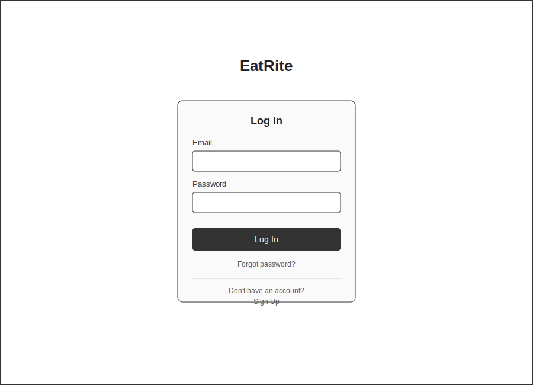
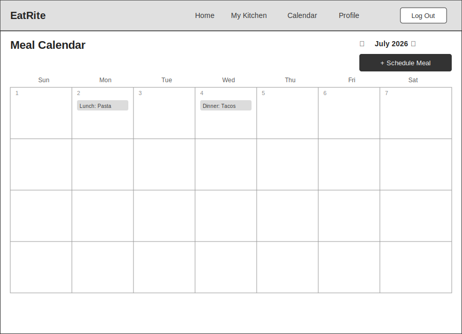

# Wireframes

Reference the Creating an Entity Relationship Diagram final project guide in the course portal for more information about how to complete this deliverable.

## List of Pages

- ⭐ Home / Recipe Results
- ⭐ My Kitchen
- ⭐ Add Ingredient
- ⭐ User Profile
- ⭐ Log In / Sign Up
- ⭐ Meal Calendar

## Wireframe 1: Home / Recipe Results

## Wireframe 2: My Kitchen

## Wireframe 3: Add Ingredient

## Wireframe 4: User Profile

## Wireframe 5: Log In / Sign Up

## Wireframe 6: Meal Calendar

